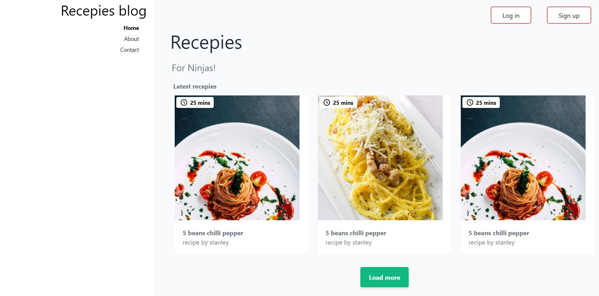

# Receipes blog styled completely with tailwindcss
before now, never worked with any of these other css frameworks as i'm not a fan of css frameworks. But the concept of tailwindcss was so appealing to me when i first heard of it. So i played around with tailwindcss to see how flexible and advanced the framework is. And my first tailwindcss project is this blog, so enjoy!

## Will i be using tailwindcss from now on?
**definitely a big yes!!**

## Pros of tailwindcss
- Easy to learn! very very easy!
- Save you a ton of time when design an html page
- the tailwindcss intelisense vscode extension is very good (but i had to deactivate my tabnine from working in my html and css files for me to really utilize the extension)

## Cons of tailwindcss
- Combinator selectors from vanilla css are not available since tailwind is mainly class based styling (i hope they find a way around this in the future)
- Each time you try to add your own class to the tailwindcss list of classes, you have to run the tailwindcss compiler again! this can be time consuming
- At first you have to spend alot of time in searching for alot of classes in their documentation
- Your html code might become very complicated and verbose as codebase grows

-

# Below is what the blog looks like

-

If you're cloning my repo for whatever reasons, run the following commands after your download
1. npm install
2. npm run build-css

visit the tailwindcss website to learn more about all the classes they offer!!

[Tailwindcss website](https://tailwindcss.com/docs/)